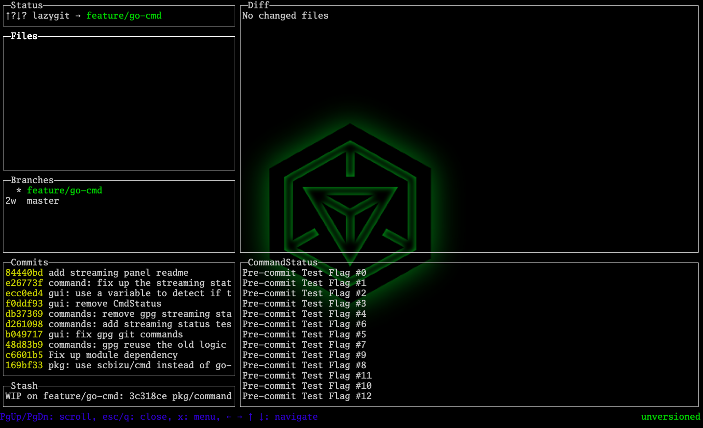

## Streaming Git Status Panel
> The configurable lazygit plugin
---

TL;DR

### Start up

* Enter the lazygit main panel,and type `o` to open the config file.

* append `commandStatus: true` option to your config file

* reopen lazygit and ENJOY!

> TIPS: use `J/K` key bindings to scroll down/up the streaming panel

### Limitation

* only support `git commit` now.

* do not support `git commit` with gpg key
